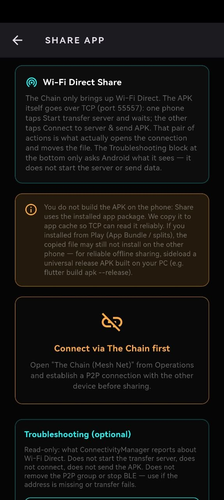
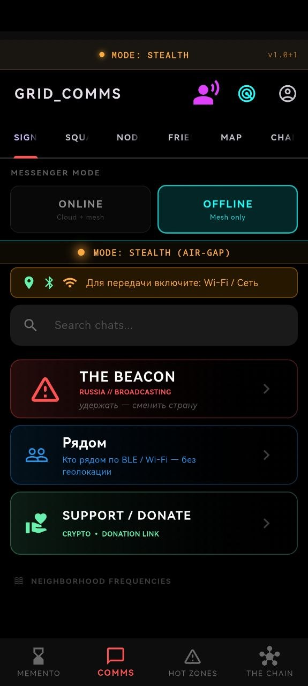
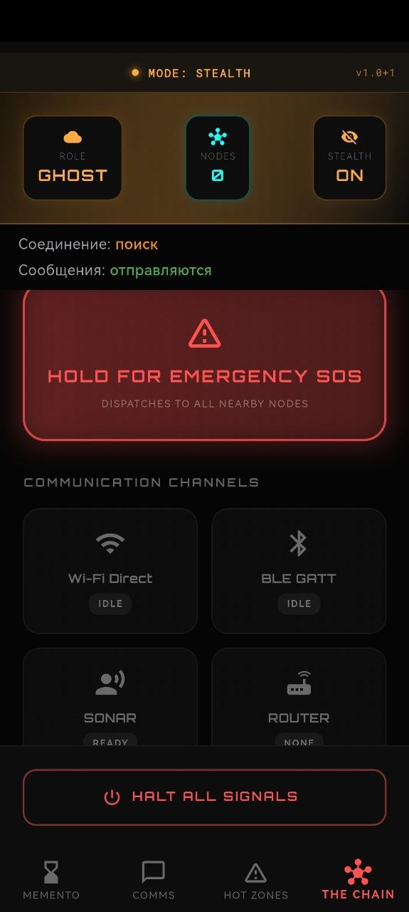

# 💀 Memento Mori  
### Autonomous Shadow Mesh Infrastructure

**Resilient Decentralized Communication for Extreme Environments**  
*Offline-First • Delay-Tolerant • Privacy-Preserving*

 

---

## ⚠️ RESEARCH PREVIEW (ALPHA)

> **Memento Mori is currently under active engineering development.**  
> The protocol implementation and routing logic are designed for research of **Delay-Tolerant Networks (DTN)**.  
> While the core transport layer is functional, this software is **not recommended for mission-critical use** without independent validation.

---

## 💀 The Mission

**Memento Mori** is a fault-tolerant autonomous mesh infrastructure designed to operate under **total network degradation**.

The project implements a shadow communication layer beneath the traditional Internet, leveraging:

- Acoustic signaling  
- Radio-based discovery  
- Opportunistic cloud gateways  

It is built for environments where connectivity is intermittent, hostile, monitored, or deliberately suppressed.

---

## 🧠 Core Engineering Innovations

### 1️⃣ Advanced Hardware Interlock (Android Fragmentation Solution)

Standard Android APIs often fail on fragmented hardware (Huawei, Xiaomi, Samsung) due to aggressive battery optimization.

Memento Mori implements a custom **Hardware Abstraction Layer (HAL)**:

- **Vendor-Specific Strategies**  
  Reverse-engineered BLE behavior to bypass background restrictions on Huawei/Honor devices.  
  Uses inverted logic (Passive Peripheral vs Active Central).

- **Finite State Machine (FSM)**  
  Deterministic Bluetooth/Wi-Fi management preventing GATT 133 deadlocks.

- **Biological Burst-Mode**  
  Nodes synchronize wake cycles and exchange data in short bursts — reducing battery usage by up to **90%**.

---

### 2️⃣ Multi-Layer Hybrid Transport

- 🦇 **Acoustic Sonar (L2)**  
  Ultrasonic BFSK modulation (18–20 kHz) using Goertzel detection.

- 📡 **BLE Control Plane**  
  Zero-connect topology inference via advertising packets.

- ⚡ **Wi-Fi Direct (Data Plane)**  
  Automatic high-bandwidth escalation after BLE verification.

---

### 3️⃣ Distributed Consistency (DTN)

- **Store-and-Forward Architecture** — encrypted local Outbox  
- **Gossip Protocol** — epidemic propagation  
- **CRDTs** — convergence guarantee during partitions  

---

### 4️⃣ High-Grade Security (Decoy & Panic)

- **Decoy Mode**  
  Dual-password architecture:
  - Real Vault  
  - Decoy Vault (identical UI)

- **Panic Wipe**  
  Shake-to-Kill instantly erases keys and logs.

- **Ghost Identity**  
  Offline Ed25519 identities stored in encrypted SQLite (WAL mode).

---

## 🗺️ Roadmap

- [x] BLE zero-connect discovery  
- [x] Hardware Interlock FSM  
- [x] Acoustic Sonar (BFSK)  
- [x] Wi-Fi Direct Auto-Negotiation  
- [x] Gossip Protocol  
- [x] Store-and-Forward Outbox  
- [x] Decoy Mode  
- [x] Panic Wipe  
- [ ] Gradient-based multi-hop routing  
- [ ] Double Ratchet (E2EE)  
- [ ] LoRa WAN via USB/UART  
- [ ] Camouflage UI mode (Calculator disguise)

---

## 🛠 Tech Stack

- **Language:** Dart (Flutter) + Kotlin (Native Channels)  
- **Architecture:** Clean Architecture + BLoC  
- **Database:** SQLite (Drift, WAL Mode)  
- **Cryptography:** `pointycastle`, `cryptography` (Ed25519, AES-GCM)  
- **Signal Processing:** Goertzel Algorithm  

---

## 🌐 Project Website

👉 https://pslergy.github.io/memento-mori-app/

---

## 📥 Getting Started

### Prerequisites

- Flutter SDK 3.x+  
- Android device (API 26+)  
  *Emulators have limited BLE/Wi-Fi Direct support.*

### Installation

This repository contains the skeleton. The soul is elsewhere.

---

## ❤️ Support Memento Mori

Memento Mori is an independent, open-source research project developed by a solo developer. It is **free for everyone**, especially for those in conflict zones and under censorship.

If you find this work valuable — for privacy research, off‑grid communication, or humanitarian technology — please consider supporting it.

### 💚 GitHub Sponsors

You can sponsor me directly via GitHub:

👉 [github.com/sponsors/pslergy](https://github.com/sponsors/pslergy)

Even a small monthly donation helps cover development costs, testing devices, and keeps the project sustainable.

### 📄 More options

We are also pursuing grants and setting up transparent funding through Open Collective.  
For details, current status, and other ways to help (testing, reporting bugs, contributing code), see our **[funding page](funding.md)**.

---

*Memento Mori is built for those who cannot rely on the internet. Your support keeps it alive.*

---

## 📚 Documentation

- `ARCHITECTURE.md` — System design & transport layers  
- `WHY_NOT_SIGNAL.md` — Architectural comparison  
- `SECURITY.md` — Threat model & cryptography  

---

## 🤝 Contributing

Contributions are welcome.  
Please read `CONTRIBUTING.md` before opening issues.

**Areas of interest:**

- DSP optimization  
- Android HAL behavior  
- Cryptographic review  

---

## 📄 License

Licensed under **GNU GPL v3.0**.  
See `LICENSE` for details.

---

**Memento Mori Project**  
High-Resilience Distributed Systems Research  
Created by **Pslergy**

