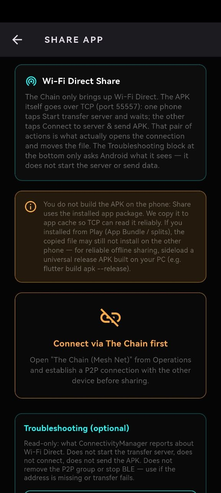
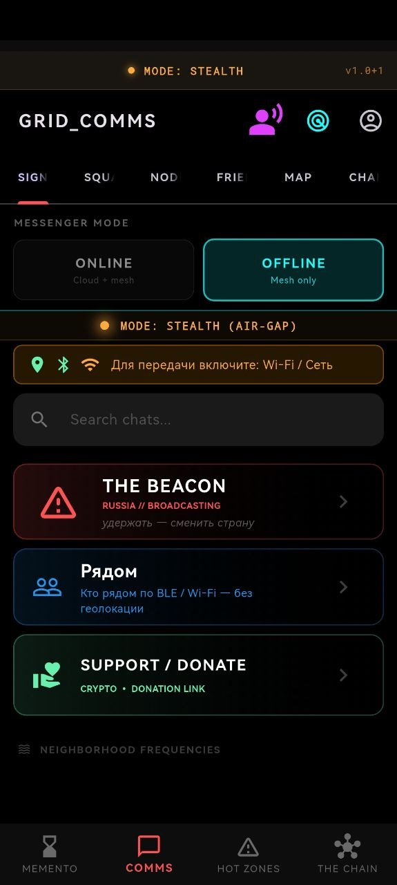
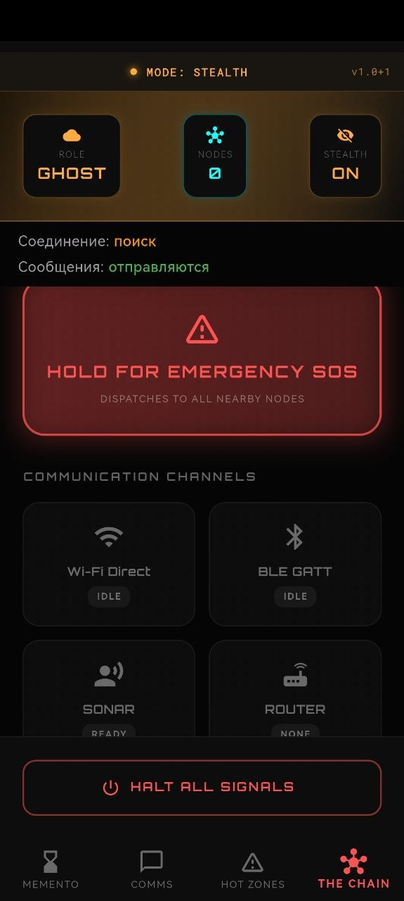
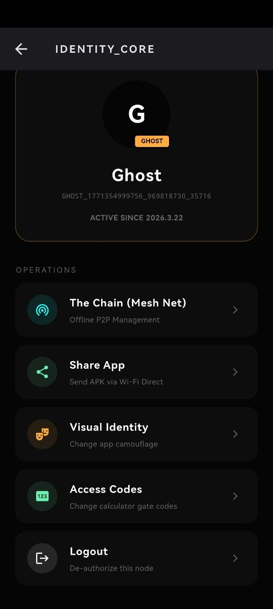
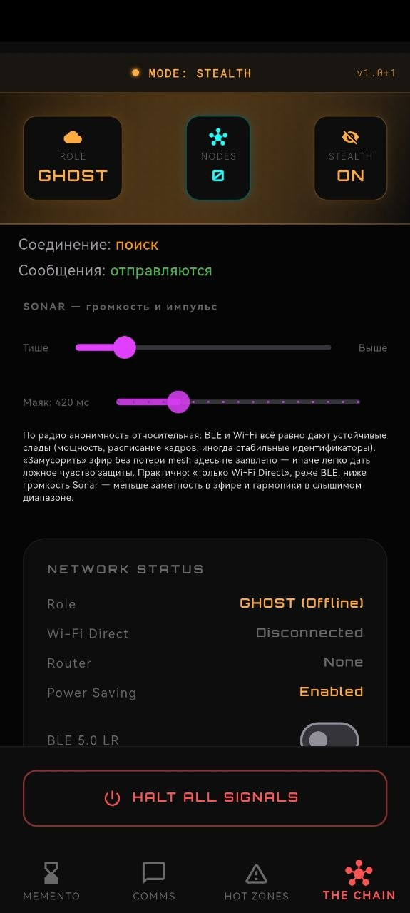

# 💀 Memento Mori  
### Resilient Offline-First Mesh Infrastructure

**Autonomous Decentralized Communication for Extreme Environments**  
*Delay-Tolerant • Zero-Trust • Air-Gapped Capable*

 

---

## ⚠️ RESEARCH PREVIEW (ALPHA)

> **Memento Mori is currently under active engineering development.**  
> The protocol implementation and routing logic are designed for research in **Delay-Tolerant Networks (DTN)** and mobile hardware limitations.  
> *Note: This repository contains the open-source skeleton. The production-ready transport layers and hardware workarounds are available via our commercial SDKs (see below).*

---

## 💼 Commercial SDKs & Enterprise Integration

Building a commercial IoT, Hardware, or off-grid messaging app? Standard Android APIs often fail on fragmented hardware (dropping BLE packets on Huawei/Xiaomi, aggressive background execution limits, etc.). 

We packaged our production-ready transport layers into standalone SDKs that solve these hardware limitations out-of-the-box:

*   **BLE Messaging Transport SDK:** Includes the custom Huawei "Pull-Mode", GATT 133 auto-recovery, and chunked messaging.
*   **Offline Sync SDK** (CRDT)
*   **Discovery Relay SDK**

👉 **[Test the Demo APK & Get the Source Code Here](https://github.com/pslergy/flutter-ble-messaging-demo)**

---

## 💀 The Mission

**Memento Mori** is a fault-tolerant autonomous mesh infrastructure designed to operate under **total network degradation**. 

It is built for environments where traditional infrastructure fails or is unavailable: disaster recovery zones, remote expeditions, underground facilities, and highly congested or actively interfered RF environments. It leverages multi-layer transports to maintain data integrity and delivery without relying on a central server.

---

## 🧠 Core Engineering Innovations

### 1️⃣ Advanced Hardware Interlock (Android Fragmentation Solution)
Aggressive battery optimization on modern Android devices (Huawei, Xiaomi, Samsung) destroys background P2P connections. Memento Mori implements a custom **Hardware Abstraction Layer (HAL)**:
- **Vendor-Specific Strategies:** Reverse-engineered BLE behavior to bypass background restrictions (e.g., using inverted Passive Peripheral vs. Active Central logic).
- **Finite State Machine (FSM):** Deterministic Bluetooth/Wi-Fi management preventing `GATT 133` deadlocks.
- **Biological Burst-Mode:** Nodes synchronize wake cycles and exchange data in short bursts — reducing battery drain significantly.

### 2️⃣ Multi-Layer Hybrid Transport
- 🦇 **Acoustic Sonar (L2):** Ultrasonic BFSK modulation (18–20 kHz) using Goertzel detection for extremely close-range, radio-free discovery.
- 📡 **BLE Control Plane:** Zero-connect topology inference via advertising packets.
- ⚡ **Wi-Fi Direct (Data Plane):** Automatic high-bandwidth escalation after BLE verification.

### 3️⃣ Distributed Consistency (DTN)
- **Store-and-Forward Architecture:** Encrypted local Outbox.
- **Gossip Protocol:** Epidemic propagation with anti-chaos limits.
- **CRDTs:** Convergence guarantee during network partitions.

### 4️⃣ Anti-Forensics & Device Security
Designed to protect data at rest on physically compromised devices:
- **Decoy Mode:** Dual-password architecture featuring a Real Vault and a Decoy Vault (with an identical UI).
- **Panic Wipe:** Shake-to-Kill instantly erases encryption keys and sensitive logs.
- **Ghost Identity:** Offline Ed25519 identities stored in an encrypted SQLite database (WAL mode).

### 5️⃣ Network Resiliency & Obfuscation
Built to withstand active network interference and traffic analysis:
- **DPI Evasion Heuristics:** Advanced socket monitoring to detect Deep Packet Inspection (DPI) anomalies (e.g., TLS handshake manipulation or TCP blackholing).
- **Traffic Masking:** SNI domain spoofing and asymmetric fallback channels to blend encrypted payloads with standard web traffic.
- **Immune Protocol:** Nodes exchange successful routing "recipes" offline via BLE, allowing the swarm to adapt to network blocks autonomously.

---

## 🗺️ Roadmap

- [x] BLE zero-connect discovery  
- [x] Hardware Interlock FSM  
- [x] Acoustic Sonar (BFSK)  
- [x] Wi-Fi Direct Auto-Negotiation  
- [x] Gossip Protocol  
- [x] Store-and-Forward Outbox  
- [x] Decoy Mode & Panic Wipe  
- [x] Gradient-based multi-hop routing  
- [x] Double Ratchet (E2EE) integration  
- [ ] LoRa WAN via USB/UART support  
- [x] Camouflage UI mode (Calculator disguise)

---

## 🛠 Tech Stack

- **Language:** Dart (Flutter) + Kotlin (Native Channels)  
- **Architecture:** Clean Architecture + BLoC  
- **Database:** SQLite (Drift, WAL Mode)  
- **Cryptography:** `pointycastle`, `cryptography` (Ed25519, AES-GCM)  
- **Signal Processing:** Goertzel Algorithm  

---

## 🌐 Project Website
👉 **[pslergy.github.io/memento-mori-app](https://pslergy.github.io/memento-mori-app/)**

---

## 📥 Getting Started

### Prerequisites
- Flutter SDK 3.x+  
- Android device (API 26+)  
  *(Emulators have limited BLE/Wi-Fi Direct support. Physical devices are required for transport testing).*

---

## ❤️ Support the Research

Memento Mori is an independent, open-source research project developed by a solo engineer. It explores the absolute limits of mobile hardware in off-grid scenarios.

If you find this work valuable for IoT research, disaster-recovery tech, or decentralized systems, please consider supporting its development:

### 💚 GitHub Sponsors
You can sponsor the hardware research directly via GitHub:  
👉 **[github.com/sponsors/pslergy](https://github.com/sponsors/pslergy)**

*Even a small monthly donation helps cover development costs, testing devices (like Xiaomi/Huawei testbenches), and keeps the project sustainable.*

---

## 📚 Documentation

- `ARCHITECTURE.md` — System design & transport layers  
- `WHY_NOT_SIGNAL.md` — Architectural comparison  
- `SECURITY.md` — Threat model & cryptography  

---

## 🤝 Contributing

Contributions are welcome. Please read `CONTRIBUTING.md` before opening issues.

**Areas of interest:**
- DSP (Digital Signal Processing) optimization  
- Android HAL behavior & background execution  
- Cryptographic review  

---

## 📄 License

Licensed under **GNU GPL v3.0**.  
See `LICENSE` for details.

---

**Memento Mori Project**  
High-Resilience Distributed Systems Research  
Created by **Pslergy**

