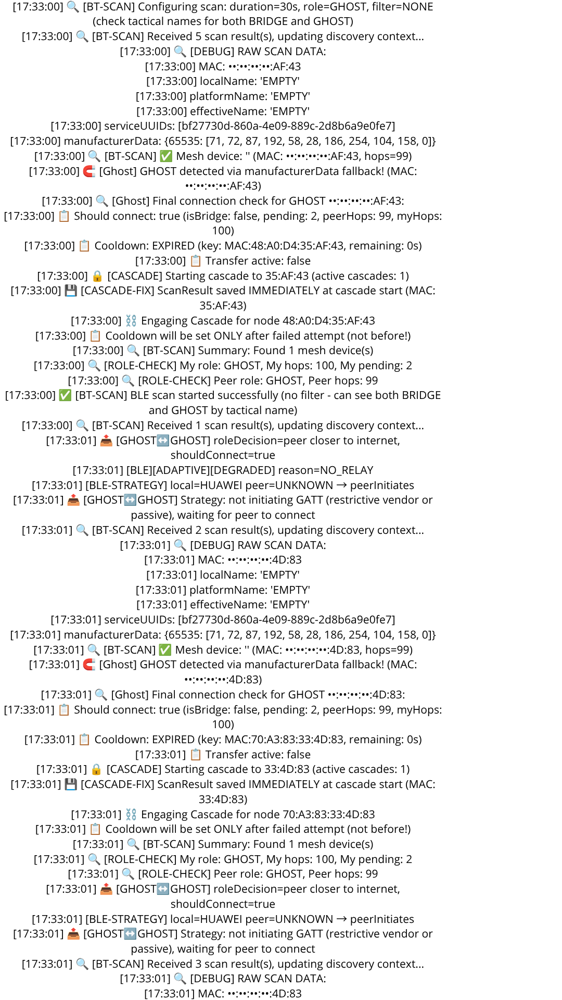
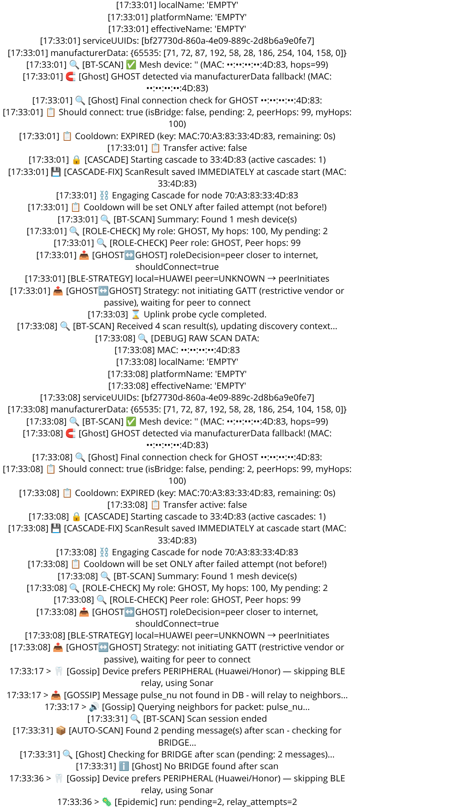
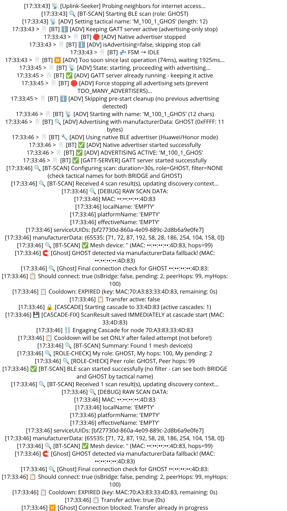

# 💀 Memento Mori
https://pslergy.github.io/memento-mori-app

The project is entering the active testing phase.

### Resilient offline-first mesh infrastructure

**Autonomous decentralized communication for constrained networks**  
*Built on a resilient mesh networking protocol — no servers, no internet, no single point of failure.
Delay-tolerant • Mesh-first • Air-gap–friendly scenarios*

 

<!-- Add screenshots under assets/screenshots/ for the gallery below -->

---

## ⚠️ Research preview — not a production release

Independent research into **delay-tolerant** and **ad hoc** mobile networking. Code is published for **education and peer review**. The mesh path can operate **without relying on a single central messaging plane**; optional cloud features may still be used when available.

---

## 🌍 The Global Problem

**2.6 billion people** worldwide lack reliable internet access. Hundreds of millions more face routine censorship, network shutdowns, or are left without communication during natural disasters. In remote areas, mountains, mines, and disaster zones, people are cut off.

| Challenge | Impact |
| :--- | :--- |
| **Network shutdowns** | 100+ documented internet shutdowns in 2024 alone |
| **No cellular coverage** | 60%+ of landmass in many countries lacks coverage |
| **Disaster zones** | Earthquakes, hurricanes, floods — cellular infrastructure fails first |
| **Remote operations** | Mines, forests, offshore — no connectivity, high risk |
| **Censorship** | 50+ countries restrict or block communication apps |

**Satellite phones** are expensive ($500–1000 + $1/min). **Radios** require licensing and don't scale. **Existing messengers** need internet.
Memento Mori replaces the need for centralized servers with a self-organizing network protocol. Devices communicate directly, relaying data through the mesh without relying on any infrastructure.

---

| Sector | Use Case | Typical Nodes |
| :--- | :--- | :--- |
| 🚨 **Search & Rescue** | Coordinating teams in remote areas | 10–100 |
| 🌊 **NGOs & Humanitarian** | Aid missions in disaster zones | 50–500 |
| ⛑️ **Emergency Services** | Fire, flood, earthquake response | 100–1000+ |
| 🏔️ **Mining & Energy** | Operations in underground/offshore sites | 50–200 |
| 🌲 **Forestry & Agriculture** | Remote land management | 20–100 |
| 🗣️ **Journalists & Activists** | Secure communication under censorship | 5–50 |
| 🏕️ **Adventure & Tourism** | Expeditions, trekking, sailing | 2–20 |

## 🧠 Core research areas

At its core, Memento Mori implements a decentralized mesh networking protocol — a set of rules for how devices discover each other, route messages, and synchronize data without a central server. This protocol is transport-agnostic (BLE, Wi-Fi Direct, acoustic) and designed for high-latency, low-connectivity environments.

### 1. Hardware-aware transport

Coping with vendor power limits, flaky radio, and Android BLE quirks (background limits, `GATT_BUSY`, fragmentation). Supported vendors include **Huawei, Samsung, Tecno, Xiaomi, Honor** with vendor-specific profiles.

### 2. Hybrid transport stack

| Layer | Role |
|-------|------|
| **BLE** | Discovery, control, store-and-forward messaging |
| **Wi‑Fi Direct** | On-demand higher throughput where supported |
| **Acoustic (experimental)** | Close-range exchange without BLE/Wi‑Fi |
| **LoRaWAN (planned)** | Long-range, low-bandwidth extension |

### 3. Distributed consistency

Store-and-forward queues, **epidemic-style** relay with TTL/dedup, **CRDT-oriented** sync for partitioned histories. Full sync cycle: `HEAD_EXCHANGE` → `REQUEST_RANGE` → `LOG_ENTRIES`.

These mechanisms form the backbone of the mesh networking protocol, ensuring reliable delivery even when nodes are only intermittently connected.

### 4. Local data protection

Dual-context storage (e.g. REAL / decoy paths), selective key handling, offline-oriented identity material. See [**SECURITY.md**](SECURITY.md) for limits and threat model.

### 5. Resilience & obfuscation

Transport diversity, optional **DPI-oriented** channel selection, **hop-count–based** uplink heuristics (GHOST/BRIDGE roles). *Not* a full continuous “gradient field” router — see status table below.

---

## 📊 Current Status

| Component | Status | Notes |
|-----------|--------|-------|
| BLE discovery & messaging | ✅ Working | Tested on Huawei, Samsung, Tecno, Xiaomi |
| CRDT-based history sync | ✅ Working | Full cycle implemented |
| Store-and-forward outbox | ✅ Working | Outbox → scan → connect → send → ACK → delete |
| Wi-Fi Direct transport | ✅ Working | TCP fallback when BLE congested |
| Acoustic channel | ✅ Working | Experimental, close-range |
| DPI-aware transport selection | ✅ Working | Smart channel selection |
| Symmetrical Ratchet with Epoch-based Sync | ✅ Working | Optional mode |
| Bridge (Internet Gateway) | ✅ Working | Host header substitution, HMAC signing |
|  Mesh networking protocol |	✅ Working |	Decentralized, self-organizing, transport-agnostic |
| Multi-Hop (3+ devices) | 🧪 Testing | Architecture ready, field validation needed |
| Epidemic cycle | 🧪 Testing | Implemented but disabled by default |
| Gradient-based routing | 🧪 Testing | Requires calibration with real data |
| LoRaWAN integration | 📋 Planned | For extended range |
| Field tests (real terrain) | 📋 Planned | Forest, mountains, urban |
| Stress tests (5–10+ nodes) | 📋 Planned | Network behavior under load |

---

## 🚧 Known Risks & Mitigations

| Risk | Description | Mitigation |
| :--- | :--- | :--- |
| **Spray-and-Wait starvation** | Messages may not forward if neighbor's `deliveryScore < 0.5` | Calibration with real-field data |
| **Entropy filtering** | May suppress popular message retransmission | Fine-tune coefficients |
| **BLE scan congestion** | Scan blocked during GATT connection | Optimize `NetworkPhaseContext` phase model |
| **Multi-hop reliability** | Not tested on 3+ devices | Test with 5–7 device fleet |
| **Real terrain performance** | Forest/mountain/urban coverage unknown | Dedicated field test campaign |

---

## 🛠 Tech stack

| Area | Stack |
|------|--------|
| App | **Dart** (Flutter), **Kotlin** (platform channels) |
| DI / state | **get_it**, **Provider** (not BLoC in the main app) |
| Local DB | **SQLite** via **sqflite** |
| Crypto | **`cryptography`**, **`crypto`** (see SECURITY.md — not a Signal clone) |
| DSP | Goertzel / FFT utilities where used for acoustic experiments |

---

## 📥 Getting started

### Prerequisites

- Flutter SDK **3.x** (`>=3.1.0` per `pubspec.yaml`)
- **Android** device (API 26+ recommended)
- **Physical devices** for meaningful mesh / BLE tests (emulator coverage is limited)

---

## 📚 Documentation

| Document | Description |
|----------|-------------|
| [**ARCHITECTURE.md**](ARCHITECTURE.md) | System design & transport layers |
| [**WHY_NOT_SIGNAL.md**](WHY_NOT_SIGNAL.md) | Design rationale vs Signal-class messengers |
| [**SECURITY.md**](SECURITY.md) | Threat model & cryptography (high level) |
| [**Field Test Log**](field_test_2026_06_23.pdf) | GHOST ↔ GHOST BLE GATT relay, Huawei ↔ Xiaomi |

---

📈 Business Model (Enterprise)
Pay-Per-Node Licensing — value scales with deployment size.

Deployment Size	Approx. Nodes	Target Sector
Small Team	5–10	Search & rescue, expeditions
Medium Operation	50–200	Mining, forestry, NGO missions
Large Enterprise	500–2000+	Emergency services, government
Custom	Varies	Military, critical infrastructure
Additional Revenue: Customization, LoRa integration, API, support & maintenance.

🗺️ Roadmap
Timeline	Milestone
Month 1	Test fleet (5–7 devices), multi-hop validation, stress tests
Month 2	Field tests (forest, mountains, urban), calibration
Month 3	LoRaWAN integration, UI/UX MVP enhancements
Month 4–6	Pilot programs with enterprise clients, user testing
Month 7+	General availability, support for iOS

---

## 🤝 Contributing

Research welcome in transport behavior, crypto review, and DSP. Please read [**CONTRIBUTING.md**](CONTRIBUTING.md) before opening issues or PRs.

---

## 📄 License

**GNU General Public License v3.0** — see [LICENSE](LICENSE).

---

Memento Mori — memento mori: systems should survive disconnections.

Independent research project. Core mesh algorithms are proprietary until formal validation. Community client and core protocols remain open-source.

